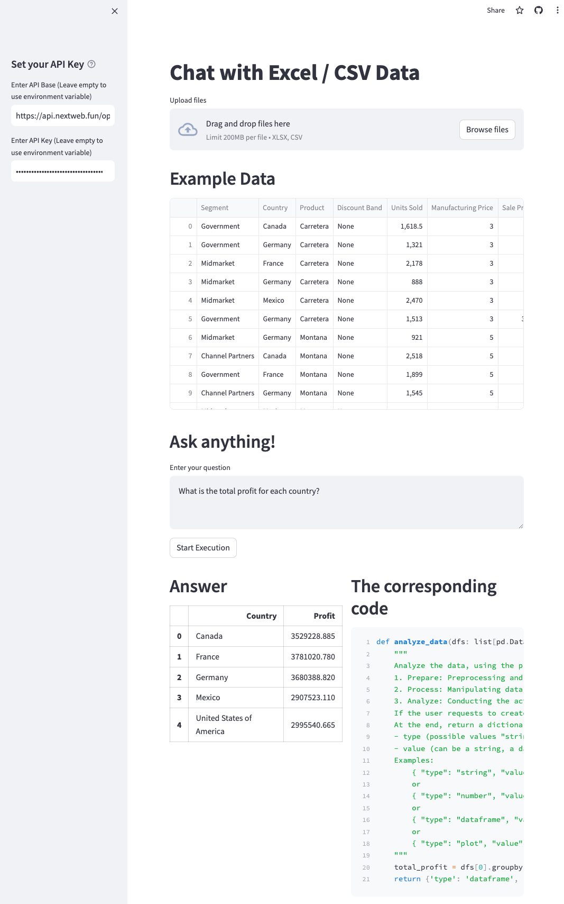
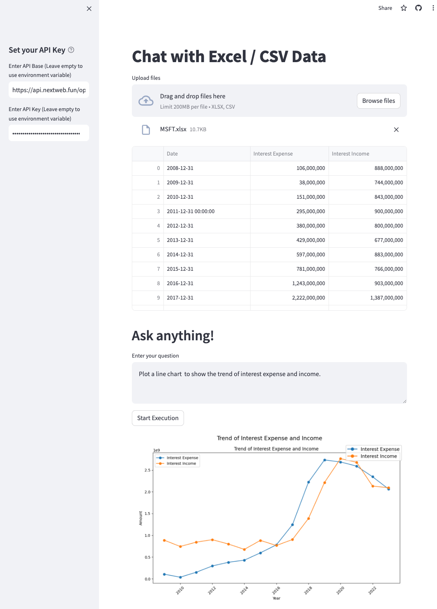

# Chat with Excel / CSV Data

<p align="center">
  <a href="https://chat-data.streamlit.app/"></a>
</p>

This is a Streamlit application that allows users to upload Excel or CSV files, analyze the data, and execute code to display results.

# Demo

[https://chat-data.streamlit.app](https://chat-data.streamlit.app/)

Analyze data             | Plot data 
:-------------------------:|:-------------------------:
[](https://chat-data.streamlit.app/)  |  [](https://chat-data.streamlit.app/)

## Features

- Upload multiple Excel or CSV files
- Analyze the data using the SmartDatalake library
- Execute code to display results
- Use OpenAI's GPT-3 language model for code generation
- Display the result and the corresponding code

## Requirements

- Python 3.9 or higher
- Streamlit
- pandas
- dotenv
- pandasai
- openai

## Installation

1. Clone this repository:

   ```
   git clone https://github.com/jeremy-feng/chat-data.git
   ```
2. Install the required packages:

   ```
   pip install -r requirements.txt
   ```

## Usage

1. Set your OpenAI API key:

- You can set your API key in the text input field on the application.
- Alternatively, you can set your API key as an environment variable named `OPENAI_API_KEY`.

2. Upload your Excel or CSV files:

- You can upload multiple files at once.
- The application will display the data in a dataframe.

3. Ask a question:

- Enter your question in the text area.
- Click the "Start Execution" button to execute the code and display the result.

4. View the result and the corresponding code:

- The result of the code execution will be displayed below the "Start Execution" button.
- The corresponding code will be displayed below the result.

## License

[MIT](https://choosealicense.com/licenses/mit/)
